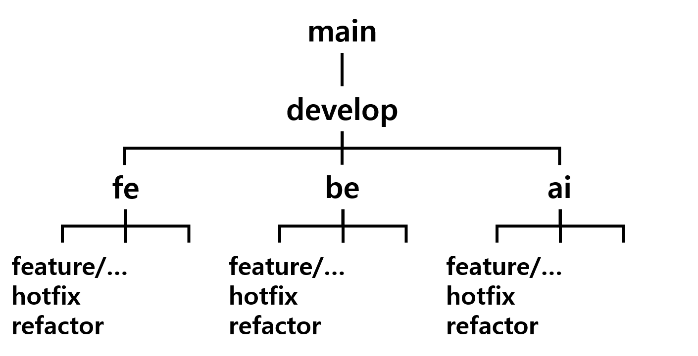
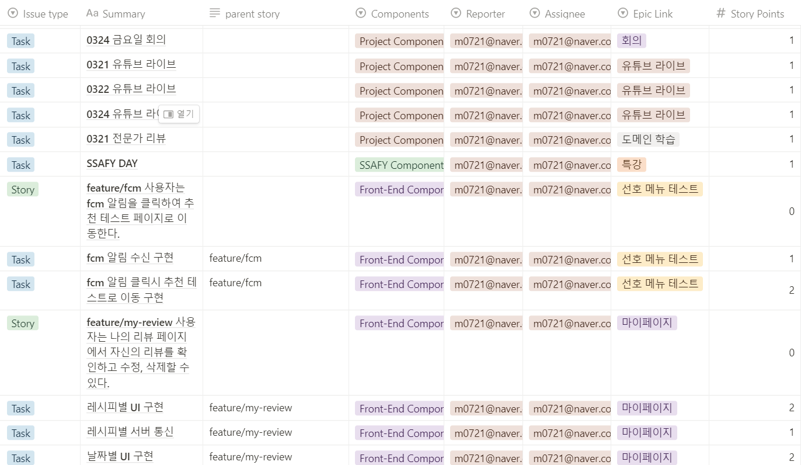

# 팀 협업 컨벤션

# 1. Git 활용

## 1. 깃 플로우

<div>
    
</div>

```
1. jira의 story에서 Create branch를 클릭해 브랜치를 생성한다.
2. 안드로이드 팀의 경우 Source를 fe로, 서버 팀의 경우 Source를 be로 선택한다.
3. branch name에 prefix는 그대로 두고 뒤에 **-feature/기능이름**을 작성한다.
4. Add - Commit - Push - Merge Request 의 과정을 거친다.
5. Merge Request가 작성되면 작성자 이외의 다른 팀원이 Code Review를 한다.
6. Code Review가 완료되면 Merge Request 작성자가 FE 또는 BE 브랜치로 merge 한다.
```

## 2. commit 규칙

```markdown
**[FEAT] @id - 메시지**
메시지는 한글로 작성
```

```markdown
- FEAT : 새로운 기능 구현
- FIX : 버그, 오류 해결
- UI : 안드로이드 UI 코드만 추가한 경우
- RESOLVE : Conflict 해결한 경우
- ADD : Feat 이외의 부수적인 코드 등 추가
- MOD : 코드를 수정한 경우
- DEL : 쓸모없는 코드 삭제
- CHORE : 그 이외의 잡일/ 버전 코드 수정, 패키지 구조 변경, 파일 이동, 가독성이나 변수명, reformat 등
- REFACTOR : 내부 로직은 변경 하지 않고 기존의 코드를 개선하는 리팩토링 시
- RENAME : 파일명이나 폴더명을 수정만 한 경우
- DOCS : README나 WIKI 등의 문서 개정
- TEST : 테스트 코드 추가
```

## 3. Merge Request 규칙

```
1. Merge Request는 feature 단위 작업이 끝나면 fe/be 브랜치로 올립니다.
2. Source Branch는 작업이 끝난 feature 단위 브랜치, Target Branch는 fe/be 브랜치를 선택합니다.
3. Title은 gitlab에서 생성해주는 그대로 작성하되 맨 앞에 #Done을 붙이고, Description은 해당 브랜치에서 작업한 내용을 작성합니다.
4. Asignee에 자신을, Reviewer에는 코드리뷰 담당자를 선택합니다.
```

<br>

# 2. Jira 활용

## 1. Jira Flow

```markdown
1. 이슈 생성
2. 백로그에 이슈 등록
3. 스프린트 생성하기
4. 백로그에 있는 이슈 스프린트로 옮기기
5. 스프린트 시작하기
```

## 2. Issue 분류

- **`Epic`**
    - 큰 규모의 업무
- **`Story`**
    - Epic을 달성하기 위해 수행해야 할 업무
    - 해당하는 Epic 하위에 FE, BE 각각 feature 단위로 만들고 Story에서 feature branch 생성
- **`Task`**
    - 스토리를 완료하기 위해 개발자가 실제로 작업해야 하는 단위 작업
    - Commit 단위로 나눠서 작성하여 Story Point를 부여

## 3. D104 Jira 등록 Rule



- 매주 월요일 회의 때 노션 Sprint 페이지에 형식에 맞춰 입력하면 팀장이 확인 후 표를 csv로 추출해 지라에 일괄 등록합니다